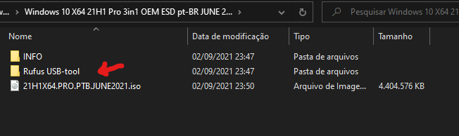
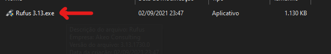
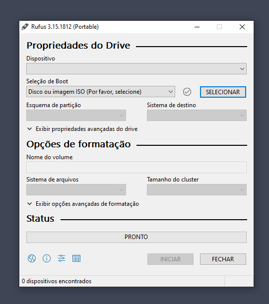
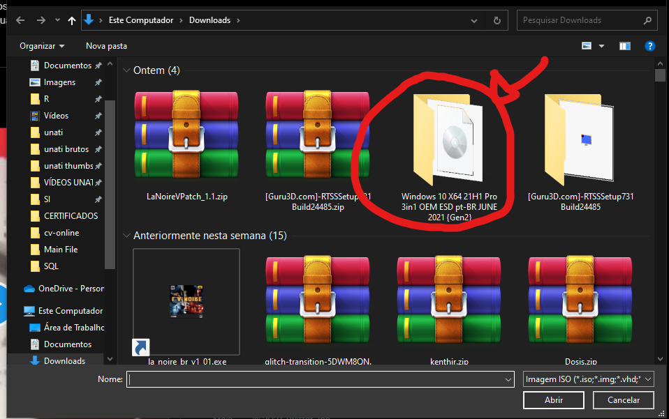
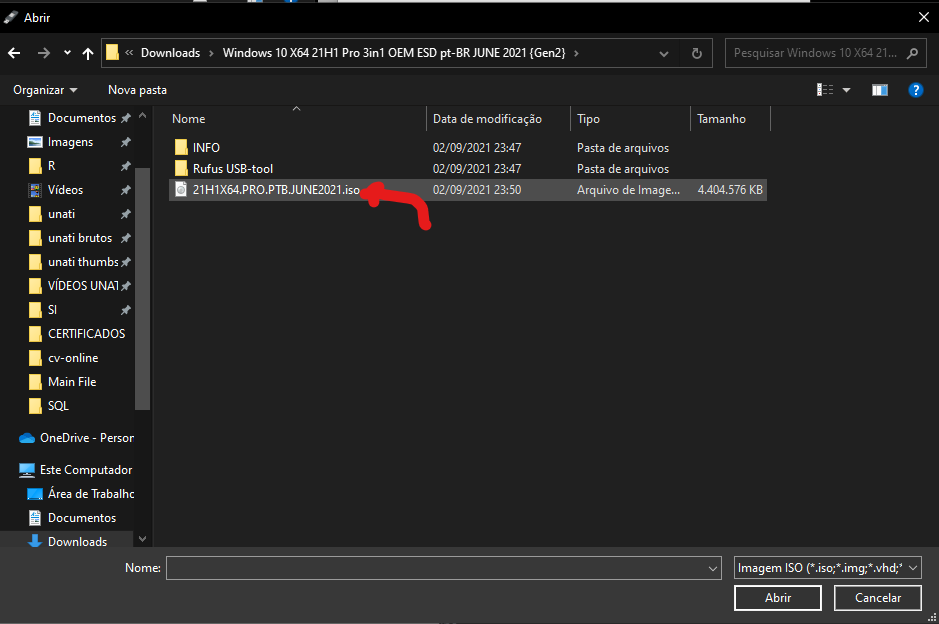
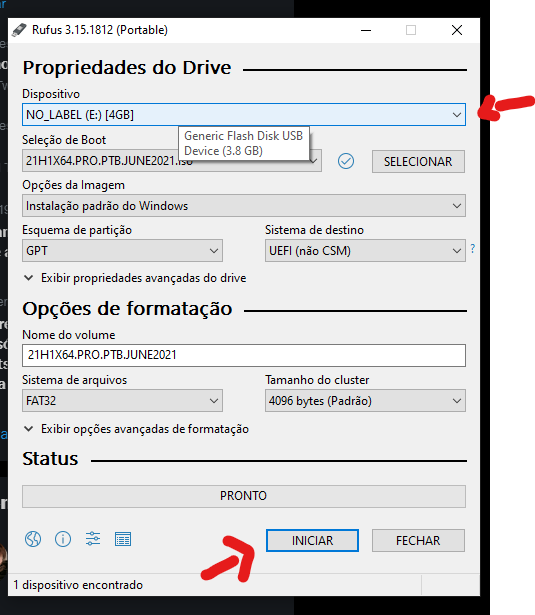

### **Tutorial**
#### **1. Baixe o Windows 10:** 
Todo o conteúdo necessário para a instalação estará [na pasta baixada por torrent AQUI](https://thepiratebay10.org/torrent/46740109/Windows_10_X64_21H1_Pro_3in1_OEM_ESD_pt-BR_JUNE_2021__Gen2_)

#### **2. Coloque o pendrive no PC**
Lembre que ele será **formatado** no processo.

#### **3. Abra o programa Rufus:**
Ele estará em uma pasta dentro da pasta baixada no torrent

#### **4. Selecione o arquivo .iso baixado:**
Na tela inicial do rufus, aperte em SELECIONAR e vá até o arquivo .iso

#### **5. Escolha o pendrive que será usado com cuidado e inicie o processo:**
No campo 'Dispositivo', verifique se o pendrive que será usado confere. **Lembre que ele será formatado no processo!**

#### **6. Espere o fim do processo**

