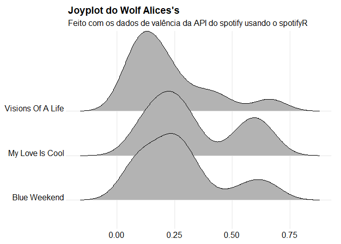
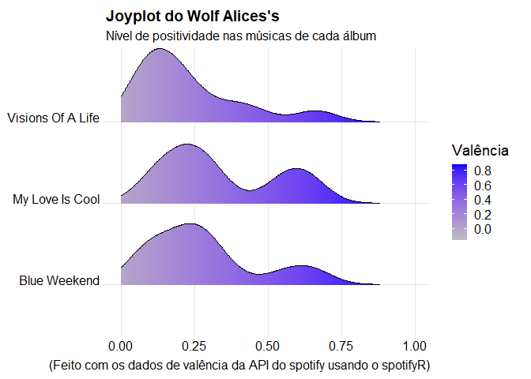
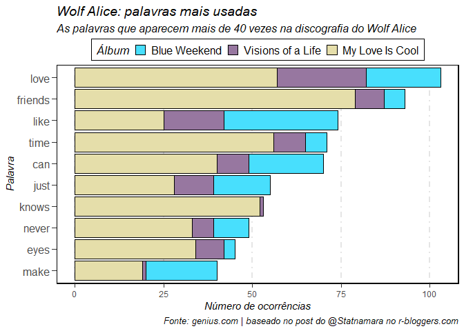
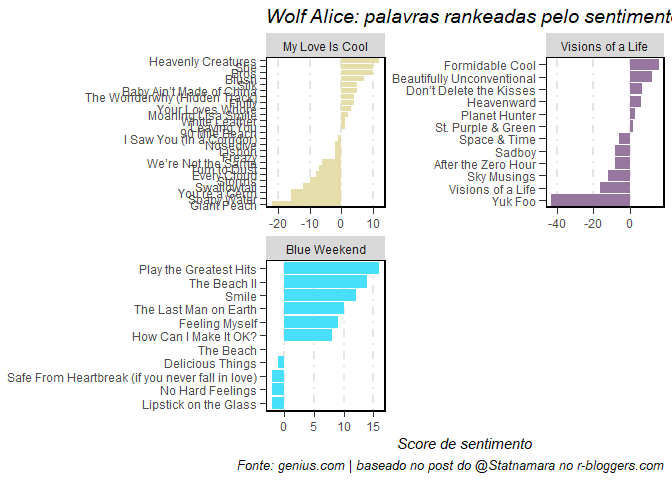

<!-- ## Análises rápidas da discografia do Wolf Alice usando dados do Spotify e do Genius -->
Fiz esse post inspirado por posts do Tom MacNamara aka @Statnamara no [r-bloggers.com](https://www.r-bloggers.com/2021/01/scraping-analysing-and-visualising-lyrics-in-r/), [da Simran Vatsa no Medium](https://medium.com/@simranvatsa5/taylor-f656e2a09cc3), [do Charlie Thompson na página pessoal dele](https://www.rcharlie.com/blog/fitter-happier/) e da [Página do pacote spotifyR (criado pelo próprio RCharlie)](https://www.rcharlie.com/spotifyr/). 

Recomendo para uma visão mais aprofundada, uma visita a todas essas páginas, bem como às páginas das documentações e dos repositórios dos desenvolvedores e dos pacotes usados. Dito isso, vamos lá.
<!-- Caso alguém realmente queira fazer algo parecido (e mais bem feito), recomendo que siga os posts referidos ao invés do meu. Não sou grande expert e praticamente copiei um pouco de cada um deles (em alguns casos consegui inclusive copiar errado! tanto que teve coisa que não funcionou). Mas se por ventura você chegou até aqui, obrigado e vamos lá. -->


### Chamando os primeiros pacotes

```r
library(tidyverse)
library(spotifyr)
```
Ao longo do post, chamaremos mais alguns.

### Autenticação da API do Spotify
Temos que pegar os dados a partir de uma conta de desenvolvedor [nesse link](https://developer.spotify.com/my-applications/#!/applications)


Coloque os dados que você gerou. Tenha cuidado ao disponibilizar seu código (você pode acabar mostrando seus tokens). Uma solução interessante pra isso é o pacote [config](https://github.com/rstudio/config). Nele você consegue salvar suas keys em um arquivo .yaml e depois pegar elas. Com isso há a possibilidade de se adicionar o arquivo ao gitignore do repositório e esconder as chaves no código compartilhado.
```
Sys.setenv(SPOTIFY_CLIENT_ID = 'xxxxxxxxxxxxxxxxxxxxxxxxxxxxx')
Sys.setenv(SPOTIFY_CLIENT_SECRET = 'xxxxxxxxxxxxxxxxxxxxxxxxxxxx')

access_token <- spotifyr::get_spotify_access_token(
  client_id = Sys.getenv("SPOTIFY_CLIENT_ID"),
  client_secret = Sys.getenv("SPOTIFY_CLIENT_SECRET")
)
```

<!--  ```{r} -->
<!-- access_token <- spotifyr::get_spotify_authorization_code(scope = 'user-read-recently-played') -->

<!--  ``` -->

Agora faremos breves usos do pacote spotifyR e da API do Spotify. A [página no CRAN](https://cloud.r-project.org/web/packages/spotifyr/index.html) ou o [repositório do GitHub](https://github.com/charlie86/spotifyr) mostram bem mais coisas.

### Minhas (as suas, na verdade) músicas mais recentes escutadas

```r
library(knitr)
library(lubridate)

get_my_recently_played(limit = 5) %>% 
    mutate(artist.name = map_chr(track.artists, function(x) x$name[1]),
           played_at = as_datetime(played_at)) %>% 
    select(track.name, artist.name, track.album.name, played_at) %>% 
    kable()
```


|track.name                                                       |artist.name     |track.album.name         |played_at           |
|:----------------------------------------------------------------|:---------------|:------------------------|:-------------------|
|Requebra                                                         |Vinny           |O bicho vai pegar        |2021-09-09 01:11:49 |
|When A Blind Man Cries - Live                                    |Deep Purple     |Live At Montreux 2011    |2021-09-09 01:03:53 |
|Sex on Fire                                                      |Kings of Leon   |Only By The Night        |2021-09-09 00:55:27 |
|Walking After You                                                |Foo Fighters    |The Colour And The Shape |2021-09-09 00:52:03 |
|Would? - Live at the Majestic Theatre, Brooklyn, NY - April 1996 |Alice In Chains |Unplugged                |2021-09-09 00:46:59 |

### Meus (os seus, na verdade) artistas favoritos de todos os tempos

```r
get_my_top_artists_or_tracks(type = 'artists', time_range = 'long_term', limit = 5) %>% 
    select(name, genres) %>% 
    rowwise %>% 
    mutate(genres = paste(genres, collapse = ', ')) %>% 
    ungroup %>% 
    kable()
```


|name            |genres                                                                     |
|:---------------|:--------------------------------------------------------------------------|
|Pearl Jam       |alternative rock, grunge, permanent wave, rock                             |
|Wolf Alice      |art pop, indie pop, indie rock, modern alternative rock, modern rock, rock |
|Alice In Chains |alternative metal, alternative rock, grunge, hard rock, nu metal, rock     |
|Max Richter     |compositional ambient, post-minimalism                                     |
|Nirvana         |grunge, permanent wave, rock                                               |

### Minhas (de novo, as suas, na verdade) músicas favoritas do momento

```r
get_my_top_artists_or_tracks(type = 'tracks', time_range = 'short_term', limit = 5) %>% 
    mutate(artist.name = map_chr(artists, function(x) x$name[1])) %>% 
    select(name, artist.name, album.name) %>% 
    kable()
```


|name                  |artist.name |album.name   |
|:---------------------|:-----------|:------------|
|The Beach             |Wolf Alice  |Blue Weekend |
|Lipstick On The Glass |Wolf Alice  |Blue Weekend |
|Smile                 |Wolf Alice  |Blue Weekend |
|Feeling Myself        |Wolf Alice  |Blue Weekend |
|The Beach II          |Wolf Alice  |Blue Weekend |

### Pegando os dados do Wolf Alice
Pelo simples motivo de ser a minha banda favorita do momento. Ouçam, é muito boa!


```r
wolf_alice <- get_artist_audio_features('wolf alice')
```

#### Dando uma olhadela no que está disponível sobre a banda

```r
glimpse(wolf_alice)
```

```
## Rows: 144
## Columns: 39
## $ artist_name                  <chr> "Wolf Alice", "Wolf Alice", "Wolf Alice", "Wolf Alice", "Wolf Alice", "Wolf Alice", "Wolf ~
## $ artist_id                    <chr> "3btzEQD6sugImIHPMRgkwV", "3btzEQD6sugImIHPMRgkwV", "3btzEQD6sugImIHPMRgkwV", "3btzEQD6sug~
## $ album_id                     <chr> "1VCTWaze9kuY5IDlbtR5p0", "1VCTWaze9kuY5IDlbtR5p0", "1VCTWaze9kuY5IDlbtR5p0", "1VCTWaze9ku~
## $ album_type                   <chr> "album", "album", "album", "album", "album", "album", "album", "album", "album", "album", ~
## $ album_images                 <list> [<data.frame[3 x 3]>], [<data.frame[3 x 3]>], [<data.frame[3 x 3]>], [<data.frame[3 x 3]>~
## $ album_release_date           <chr> "2021-06-04", "2021-06-04", "2021-06-04", "2021-06-04", "2021-06-04", "2021-06-04", "2021-~
## $ album_release_year           <dbl> 2021, 2021, 2021, 2021, 2021, 2021, 2021, 2021, 2021, 2021, 2021, 2021, 2021, 2021, 2021, ~
## $ album_release_date_precision <chr> "day", "day", "day", "day", "day", "day", "day", "day", "day", "day", "day", "day", "day",~
## $ danceability                 <dbl> 0.704, 0.494, 0.355, 0.515, 0.161, 0.460, 0.318, 0.496, 0.259, 0.666, 0.393, 0.698, 0.467,~
## $ energy                       <dbl> 0.332, 0.498, 0.623, 0.764, 0.426, 0.714, 0.844, 0.376, 0.284, 0.252, 0.539, 0.351, 0.500,~
## $ key                          <int> 8, 2, 7, 11, 3, 0, 0, 2, 7, 2, 1, 8, 2, 7, 4, 3, 0, 0, 2, 7, 2, 1, 8, 2, 7, 11, 3, 0, 0, 2~
## $ loudness                     <dbl> -9.185, -5.739, -6.137, -5.238, -6.095, -5.409, -3.433, -7.469, -8.622, -13.969, -7.164, -~
## $ mode                         <int> 1, 1, 1, 1, 1, 1, 1, 0, 1, 1, 0, 1, 1, 1, 1, 1, 1, 1, 0, 1, 1, 0, 1, 1, 1, 1, 1, 1, 1, 0, ~
## $ speechiness                  <dbl> 0.0348, 0.0351, 0.0360, 0.0444, 0.0312, 0.0445, 0.0615, 0.0300, 0.0332, 0.0425, 0.0327, 0.~
## $ acousticness                 <dbl> 2.57e-01, 1.49e-01, 1.28e-01, 1.52e-04, 8.07e-01, 1.81e-02, 8.29e-06, 2.79e-02, 3.35e-01, ~
## $ instrumentalness             <dbl> 0.493000, 0.061600, 0.059200, 0.878000, 0.000390, 0.003360, 0.831000, 0.233000, 0.112000, ~
## $ liveness                     <dbl> 0.1410, 0.2610, 0.1070, 0.0640, 0.4610, 0.1220, 0.0885, 0.1050, 0.1150, 0.1110, 0.1410, 0.~
## $ valence                      <dbl> 0.2740, 0.2900, 0.1900, 0.3420, 0.2740, 0.2020, 0.5980, 0.0622, 0.0983, 0.6460, 0.0850, 0.~
## $ tempo                        <dbl> 107.982, 121.199, 93.745, 93.579, 181.783, 117.088, 177.105, 115.990, 144.493, 127.451, 10~
## $ track_id                     <chr> "7uELmcXg4U2iCcrXMvD8dj", "0f1bOH82cQvNNZBmmkKv4d", "6tWHb2caC8Kuc5oBO8dHmc", "0wQKKPy050l~
## $ analysis_url                 <chr> "https://api.spotify.com/v1/audio-analysis/7uELmcXg4U2iCcrXMvD8dj", "https://api.spotify.c~
## $ time_signature               <int> 4, 4, 4, 4, 3, 4, 4, 4, 4, 4, 4, 4, 4, 4, 4, 3, 4, 4, 4, 4, 4, 4, 4, 4, 4, 4, 3, 4, 4, 4, ~
## $ artists                      <list> [<data.frame[1 x 6]>], [<data.frame[1 x 6]>], [<data.frame[1 x 6]>], [<data.frame[1 x 6]>~
## $ available_markets            <list> <"CA", "US">, <"CA", "US">, <"CA", "US">, <"CA", "US">, <"CA", "US">, <"CA", "US">, <"CA"~
## $ disc_number                  <int> 1, 1, 1, 1, 1, 1, 1, 1, 1, 1, 1, 1, 1, 1, 1, 1, 1, 1, 1, 1, 1, 1, 1, 1, 1, 1, 1, 1, 1, 1, ~
## $ duration_ms                  <int> 155000, 304280, 247560, 196800, 152333, 287440, 147666, 283586, 261213, 155000, 219653, 15~
## $ explicit                     <lgl> FALSE, FALSE, FALSE, FALSE, FALSE, FALSE, FALSE, FALSE, FALSE, FALSE, FALSE, TRUE, FALSE, ~
## $ track_href                   <chr> "https://api.spotify.com/v1/tracks/7uELmcXg4U2iCcrXMvD8dj", "https://api.spotify.com/v1/tr~
## $ is_local                     <lgl> FALSE, FALSE, FALSE, FALSE, FALSE, FALSE, FALSE, FALSE, FALSE, FALSE, FALSE, FALSE, FALSE,~
## $ track_name                   <chr> "The Beach", "Delicious Things", "Lipstick on the Glass", "Smile", "Safe From Heartbreak (~
## $ track_preview_url            <chr> "https://p.scdn.co/mp3-preview/b0fd6cf0e769948e6248fab87c7365dac886e0bb?cid=a98de2fcd0f945~
## $ track_number                 <int> 1, 2, 3, 4, 5, 6, 7, 8, 9, 10, 11, 1, 2, 3, 4, 5, 6, 7, 8, 9, 10, 11, 1, 2, 3, 4, 5, 6, 7,~
## $ type                         <chr> "track", "track", "track", "track", "track", "track", "track", "track", "track", "track", ~
## $ track_uri                    <chr> "spotify:track:7uELmcXg4U2iCcrXMvD8dj", "spotify:track:0f1bOH82cQvNNZBmmkKv4d", "spotify:t~
## $ external_urls.spotify        <chr> "https://open.spotify.com/track/7uELmcXg4U2iCcrXMvD8dj", "https://open.spotify.com/track/0~
## $ album_name                   <chr> "Blue Weekend", "Blue Weekend", "Blue Weekend", "Blue Weekend", "Blue Weekend", "Blue Week~
## $ key_name                     <chr> "G#", "D", "G", "B", "D#", "C", "C", "D", "G", "D", "C#", "G#", "D", "G", "E", "D#", "C", ~
## $ mode_name                    <chr> "major", "major", "major", "major", "major", "major", "major", "minor", "major", "major", ~
## $ key_mode                     <chr> "G# major", "D major", "G major", "B major", "D# major", "C major", "C major", "D minor", ~
```
#### Vamos olhar só os albums

```r
wolf_alice %>% 
  distinct(album_name)
```

```
##                         album_name
## 1                     Blue Weekend
## 2                Visions Of A Life
## 3 My Love Is Cool (Deluxe Edition)
## 4                  My Love Is Cool
```

#### Vamos retirar os que são 'repetidos' (ou edições especiais)

```r
wolf_alice <- wolf_alice %>% 
  filter(!album_name %in% "My Love Is Cool (Deluxe Edition)")
```

#### Agora temos somente os albuns 'originais'

```r
wolf_alice %>% 
  distinct(album_name)
```

```
##          album_name
## 1      Blue Weekend
## 2 Visions Of A Life
## 3   My Love Is Cool
```

Dando uma olhada usando uma das informações dadas pela API, vemos que a coluna 'valence' mostra o dado de valência, que é o nível de 'positividade' ou 'regozijo' de uma faixa. Os valores vão de 0 a 1.

#### Nível de 'regozijo'


```r
wolf_alice %>% 
    arrange(-valence) %>% 
    select(track_name, valence) %>% 
    head(5) %>% 
    kable()
```


|track_name                 | valence|
|:--------------------------|-------:|
|Beautifully Unconventional |   0.664|
|Beautifully Unconventional |   0.662|
|Beautifully Unconventional |   0.661|
|No Hard Feelings           |   0.658|
|No Hard Feelings           |   0.653|

Primeiro plot:

```r
library(ggjoy)

ggplot(wolf_alice, aes(x = valence, y = album_name)) + 
    geom_joy() + 
    theme_joy() +
    ggtitle("Joyplot do Wolf Alices's", subtitle = "Feito com os dados de valência da API do spotify usando o spotifyR") +
    theme(axis.title = element_blank())
```

<!-- -->
Agora um plot mais colorido (inspirado no post da [Simran Vatsa no Medium](https://medium.com/@simranvatsa5/taylor-f656e2a09cc3)):

```r
wolf_alice %>% ggplot(aes(x = valence, y = album_name, fill = ..x..)) + 
  geom_density_ridges_gradient(scale = 0.9) + 
  scale_fill_gradient(low = "grey", high = "blue") + 
  theme(panel.background = element_rect(fill = "white")) +
  theme(plot.background = element_rect(fill = "white")) +
  xlim(0,1) +
  theme_joy() +
  theme(axis.title = element_blank()) +
  labs(fill = 'Valência') +
  ggtitle("Joyplot do Wolf Alices's", subtitle = "Nível de positividade nas músicas de cada álbum") + 
  labs(caption = "(Feito com os dados de valência da API do spotify usando o spotifyR)")
```

<!-- -->
**Tá, mas o que essas curvas realmente significam ou mostram?**
Elas mostram a distribuição de músicas de acordo justamente com a 'positividade'. Olhando pra cada uma delas, para cada um dos álbuns, nota-se que há um maior 'volume' de faixas não tão positivas assim nos 3 álbuns (por isso a maior montanha está em torno dos valores de 0~0.25).


## Agora usando o Genius

Agora tentemos usar o pacote Genius para acessar as letras do Wolf Alice:

#### Carregando o pacote

Nesse caso específico, diferente do pacote usado pro Spotify, não precisamos (por enquanto) de um token. O pacote já facilita pra gente.

```r
library(genius)
```

Selecionando os albums:

```r
wolf_alice_albums <- tribble(
 ~artist, ~album,
 "Wolf Alice", "My Love Is Cool",
 "Wolf Alice", "Visions of a Life",
 "Wolf Alice", "Blue Weekend"
)


wa_all_lyrics <- wolf_alice_albums %>% 
  add_genius(artist, album)
```

```
## Joining, by = c("album_name", "track_n", "track_url")
```

```
## Joining, by = c("artist", "album")
```
Dando uma olhada. Fica claro que tem coisa faltando (e muita - por exemplo, o número da faixa no álbum), e isso é um problema que não consegui resolver.
Ele está relacionado com o tempo que demora pra que se obtenha uma resposta na requisição, que acaba fazendo com que trechos sumam e músicas fiquem sem letra alguma (e de formas diferentes a cada vez que o código é rodado). Pra resolver isso seria necessário fazer algum tipo de configuração ou até modificação na função para que se *setasse* esse tempo de espera até que um dado fosse recebido e em seguida, finalmente, o próximo fosse requisitado. Mas eu não sei como fazer. *(É meio complicado mostrar corretamente as partes faltantes das letras nesse post, logo, confie em mim)*

```r
tail(wa_all_lyrics)
```

```
## # A tibble: 6 x 6
##   artist     album           track_n  line lyric track_title       
##   <chr>      <chr>             <int> <int> <chr> <chr>             
## 1 Wolf Alice My Love Is Cool       1    NA <NA>  Turn to Dust      
## 2 Wolf Alice My Love Is Cool       3    NA <NA>  Your Loves Whore  
## 3 Wolf Alice My Love Is Cool       4    NA <NA>  Moaning Lisa Smile
## 4 Wolf Alice My Love Is Cool       6    NA <NA>  Lisbon            
## 5 Wolf Alice My Love Is Cool       7    NA <NA>  Silk              
## 6 Wolf Alice My Love Is Cool       8    NA <NA>  Freazy
```

Agora teríamos todas as letras de todas as músicas dos 3 álbums **só que infelizmente, não!** :disappointed_relieved:. Deu pra ver o problema descrito acima.


<!-- >Getting lyrics for albums is slightly more involved. It first calls genius_tracklist() which first calls gen_album_url() then using the handy package rvest scrapes the song titles, track numbers, and song lyric urls. Next, the song urls from the output are iterated over and fed to genius_url(). -->

Aqui acontece a mesma coisa. Cada execução retorna dados diferentes e faltando sempre alguma coisa.

```r
tail(genius_album(artist = 'Wolf Alice', album = 'Blue Weekend', info = 'all'))
```

```
## Joining, by = c("album_name", "track_n", "track_url", "track_title")
```

```
## # A tibble: 6 x 8
##   album_name   track_n artist track_title             line element element_artist lyric
##   <chr>          <int> <chr>  <chr>                  <int> <chr>   <chr>          <chr>
## 1 Blue Weekend       2 <NA>   Delicious Things          NA <NA>    <NA>           <NA> 
## 2 Blue Weekend       3 <NA>   Lipstick on the Glass     NA <NA>    <NA>           <NA> 
## 3 Blue Weekend       6 <NA>   How Can I Make It OK?     NA <NA>    <NA>           <NA> 
## 4 Blue Weekend       7 <NA>   Play the Greatest Hits    NA <NA>    <NA>           <NA> 
## 5 Blue Weekend       9 <NA>   The Last Man on Earth     NA <NA>    <NA>           <NA> 
## 6 Blue Weekend      11 <NA>   The Beach II              NA <NA>    <NA>           <NA>
```

<!-- Para uma melhor visualização, usando o pacote DT. Percebe-se que há elementos faltantes. -->


Já que o pacote genius não funfa (do jeito que eu queria), bora tentar de outra maneira, usando o pacote Geniusr.

### Usando a API do Genius e o geniusr


<!-- Pegue o token lá na página de desenvolvedor do Genius. -->
<!-- ``` -->
<!-- token <- 'xxxxxxxxxxxxxxxxxxxxxxxxxxxxxxxxxxxxxxxxxxx' -->
<!-- ``` -->

```
Sys.setenv(GENIUS_API_TOKEN = 'xxxxxxxxxxxxxxxxxxxxxxxxxxx')

```
Pra usarmos o [*geniusr*](https://github.com/ewenme/geniusr), precisaremos de autenticação da API do Genius. Pegue o token lá da página de desenvolvedor do Genius e cole. Se assim não funcionar imediatamente, preste atenção na hora que rodar, o Rstudio pode pedir no console o token. Cole no console e continue.


Carregando o pacote [*geniusr*](https://github.com/ewenme/geniusr) e achando o ID do Wolf Alice

```r
library("geniusr")
search_artist("Wolf Alice")
```

```
## # A tibble: 1 x 3
##   artist_id artist_name artist_url                           
##       <int> <chr>       <chr>                                
## 1    326078 Wolf Alice  https://genius.com/artists/Wolf-alice
```

Agora sabemos que o ID da banda é '326078'.

```r
songs <- get_artist_songs_df(326078) 

# Pegando os ids de todas as músicas da banda
ids <- c(as.character(songs$song_id))

# Criando um dataframe vazio
allLyrics <- data.frame()

# Adicionando as letras ao dataframe
for (id in ids) {
  allLyrics <- rbind(get_lyrics_id(id), allLyrics)
}
# O problema é que dessa forma algumas letras ficam de fora (como no caso anterior)
```

Aqui uma forma complementar de fazer o mesmo contornando o problema:

```r
while (length(ids) > 0) {
  for (id in ids) {
    tryCatch({
      allLyrics <- rbind(get_lyrics_id(id), allLyrics)
      successful <- unique(allLyrics$song_id)
      ids <- ids[!ids %in% successful]
      # print(paste("done - ", id))
      # print(paste("New length is ", length(ids))) # esses prints eram pra mostrar cada letra sendo adicionada
    }, error = function(e){})
  }
}
```

Agora adicionando o album pra cada música no dataframe:

```r
allIds <- data.frame(song_id = unique(allLyrics$song_id))
allIds$album <- ""
```


```r
for (song in allIds$song_id) {
  allIds[match(song,allIds$song_id),2] <- get_song_df(song)[12]
  # print(allIds[match(song,allIds$song_id),]) # outro print somente pra verificação
}

allLyrics <- full_join(allIds, allLyrics)
```

Removendo discos aleatórios e *NAs*:

```r
albuns_para_remover <- c("Spotify Singles: Holiday", "Demo & Unreleased", "Spotify Singles", "Spotify Sessions",
                         "B-Sides, Demos & Shit", NA, "triple j Like a Version 14", "Ghostbusters (Original Motion Picture Soundtrack)", "NA")

musicas_para_remover <- c("Boys - triple j Like A Version") # o genius simplesmente adicionou essa música do nada
allLyrics <- allLyrics %>% 
  filter(!album %in% albuns_para_remover) %>% 
  filter(!song_name %in% musicas_para_remover)
```

Mudando o nome do 'My Love Is Cool (Deluxe Edition)' para apenas 'My Love Is Cool':

```r
allLyrics$album[allLyrics$album == "My Love Is Cool (Deluxe Edition)"] <- "My Love Is Cool"
```


Salvando um csv pro caso de ser necessário (um backup):

```r
allLyrics %>% write_csv("allLyrics.csv")
```

Dando uma olhada:

```r
head(allLyrics)
```

```
##   song_id        album                                                                 line section_name section_artist
## 1 6525032 Blue Weekend                                             If the fast life is fast      Verse 1     Wolf Alice
## 2 6525032 Blue Weekend                                              Then why does it creep?      Verse 1     Wolf Alice
## 3 6525032 Blue Weekend                                         Back at The Castle like 2016      Verse 1     Wolf Alice
## 4 6525032 Blue Weekend                                            They don't play any music      Verse 1     Wolf Alice
## 5 6525032 Blue Weekend                                                 Take it back to mine      Verse 1     Wolf Alice
## 6 6525032 Blue Weekend Life seems to move in circles when you take its straight white lines      Verse 1     Wolf Alice
##                song_name artist_name
## 1 Play the Greatest Hits  Wolf Alice
## 2 Play the Greatest Hits  Wolf Alice
## 3 Play the Greatest Hits  Wolf Alice
## 4 Play the Greatest Hits  Wolf Alice
## 5 Play the Greatest Hits  Wolf Alice
## 6 Play the Greatest Hits  Wolf Alice
```
Aparentemente tá tudo ok. É legal dar um View(allLyrics) pra verificar no próprio Rstudio com o csv ficou (ou então abrir o csv externamente).

<!-- #### Outra forma fazendo por album -->


### Analise do texto
Primeiro 'tokenizamos' as palavras

```r
allLyricsTokenised <- allLyrics %>%
  tidytext::unnest_tokens(word, line)
```

Agora contando elas, temos:

```r
allLyricsTokenised %>%
  count(word, sort = TRUE) %>% 
  head()
```

```
##   word   n
## 1    i 511
## 2  the 491
## 3  you 484
## 4  and 327
## 5   to 300
## 6    a 255
```


Mas apareceram várias 'stop words', que são palavras que apenas funcionam como conectivos ou não tem significado relevante pra uma análise. Então temos que remover essas palavras.

```r
# removendo as stop words
stop_words <- (stopwords::stopwords("en", source = "snowball")) 
tidyLyrics <- allLyricsTokenised %>%
  filter(!word %in% stop_words)

#e refazendo a contagem
tidyLyrics %>%
  count(word, sort = TRUE) %>% 
  head()
```

```
##      word   n
## 1      ah 130
## 2    love 103
## 3 friends  93
## 4    like  74
## 5    time  71
## 6     can  70
```
No caso de uma banda/artista/letra em pt-br é possível remover stop words da nossa língua (verificando a documentação ou mandando um ?stopwords no console, temos mais informações).

No fim, *Love* foi a mais frequente (o 'ah' não conta né? logo mais vamos retirar esse e outros casos específicos de stop words)

Agora iremos contar por album e montar uma visualização:

```r
topFew <- tidyLyrics %>%
  group_by(album, word) %>%
  mutate(n = row_number()) %>%
  ungroup()
```

Arrumando mais um pouco:

```r
# removendo colunas extras
topFew <- topFew %>% 
  select(album, word, n)

# pegando o máximo pra cada palavra pra cada álbum
topFew <- topFew %>%
  group_by(album, word) %>%
  summarise(n = max(n))%>%
  ungroup()
```

E agora retirando mais algumas palavras ('ooh's, 'oh's e 'ah's ) e nos limitando às que aparecem menos de 40 vezes:

```r
topFew <- topFew %>% 
  group_by(word) %>%
  mutate(total = sum(n)) %>%
  filter(total >= 40,
         word != "ooh", word != "oh", word != "ah") %>%
  ungroup()
```

### Visualizando
Faremos mais alguns preparativos antes do plot:

```r
# uma cor pra cada album (usei uma página pra pegar a cor predominante da capa de cada um)
albumCol <- c("#e5deaa",      # My Love Is Cool
              "#9777a0",      # Visions of a Life      
              "#48dffd")      # Blue Weekend
names(albumCol) <- c("My Love Is Cool", "Visions of a Life",
                     "Blue Weekend")

# usando como fatores os albums para que fiquem 'stackados' no plot
topFew$album <- factor(topFew$album, levels = c("Blue Weekend",
                                                "Visions of a Life",
                                                "My Love Is Cool"
))
```

Agora finalmente o plot:

```r
wordsPlot <- ggplot(topFew) +
  
  geom_bar(aes(x = reorder(word, total), 
               y = n,
               fill = as.factor(album)),
           colour = "black",
           stat = "identity") +
  
  coord_flip() +
  
  labs(title = "Wolf Alice: palavras mais usadas",
       subtitle = "As palavras que aparecem mais de 40 vezes na discografia do Wolf Alice",
       caption = "Fonte: genius.com | baseado no post do @Statnamara no r-bloggers.com",
       y = "Número de ocorrências",
       x = "Palavra",
       fill = "Álbum")+
  
  scale_fill_manual(values = albumCol) +
  
  theme(title = element_text(face = "italic", size = 12), 
        
        panel.border = element_rect(colour = "black", fill=NA, size=1),
        panel.background = element_rect(colour = "black", fill = "white"),
        panel.grid.major.x = element_line(colour="grey90",size = 1, linetype = 4),
        
        axis.title = element_text(face = "italic",size = 11, colour = "black"),
        axis.ticks.length = unit(5, units = "pt"),
        
        legend.background = NULL,
        legend.position = "top",
        legend.key.size = unit(12,"pt"),
        legend.box.spacing = unit(5,"pt"),
        legend.text = element_text(size = 12),
        
        axis.text.y = element_text(size = 12))

wordsPlot
```

<!-- -->

```r
# salvando a imagem
ggsave(filename = "wolfalice_chart.png", plot = wordsPlot, width = 30, height = 24, units = "cm",
type = "cairo")
```
Pelo gráfico o 'My Love Is Cool' tem uma maior proporção das palavras mais usadas nas letras  - talvez por ter mais músicas, ou as letras serem mais longas (fica aí o questionamento).

Agora faremos mais alguns preparativos pro último plot:

```r
# criando o dataframe 'sentimental'
wolf_alice_sentiments <- tidyLyrics %>%
  inner_join(tidytext::get_sentiments("bing"))%>% 
  count(album, song_name, sentiment) %>%
  spread(sentiment, n, fill = 0) %>%
  mutate(sentiment = positive - negative)

# Usando os álbuns como fatores novamente, como feito no último plot
wolf_alice_sentiments$album <- factor(wolf_alice_sentiments$album, 
                               levels = c("My Love Is Cool",
                                          "Visions of a Life",
                                          "Blue Weekend"
                               ))


# atribuindo o plot a uma variável (não é estritamente necessário)
w_a_plot <- ggplot(wolf_alice_sentiments,
                   aes(reorder(song_name, 
                               sentiment), 
                       sentiment, 
                       fill = album)) +
  
  geom_col(show.legend = FALSE) +
  
  facet_wrap(~album, 
             ncol = 2, 
             scales = "free")+
  
  scale_fill_manual(values = albumCol)+
  
  labs(title = "Wolf Alice: palavras rankeadas pelo sentimento",
       caption = "Fonte: genius.com | baseado no post do @Statnamara no r-bloggers.com",
       y = "Score de sentimento",
       fill = "Álbum")+
  
  theme(title = element_text(face = "italic", size = 12), 
      
      panel.border = element_rect(colour = "black", fill=NA, size=1),
      panel.background = element_rect(colour = "black", fill = "white"),
      panel.grid.major.x = element_line(colour="grey90",size = 1, linetype = 4),
      
      axis.title.x = element_text(face = "italic",size = 11, colour = "black"),
      axis.title.y = element_blank(),
      axis.ticks.length = unit(5, units = "pt"),
      
      legend.background = NULL,
      legend.position = "top",
      legend.key.size = unit(12,"pt"),
      legend.box.spacing = unit(5,"pt")) +
  
  coord_flip()

w_a_plot # chamando o plot
```

<!-- -->

```r
# salvando a imagem
ggsave(filename = "wolf_alice_sentiment_chart.png", plot = w_a_plot, width = 36, height = 24, units = "cm",
type = "cairo")
```
Pelo que está no gráfico é possível ter uma ideia de que o 'Blue Weekend' seria o trabalho mais positivo 'sentimentalmente'. Enquanto isso, o 'Visions of a Life' seria bem mais 'negativo' e, o segundo álbum, 'My Love Is Cool', seria um meio termo.

Lembrando também que existem maneiras muito mais bem feitas e robustas de se analisar a 'positividade', a 'raiva' e até a 'depressividade' de músicas de um álbum ou artista.Eu não tenho garbo e elegância para tal, logo deixo aqui referências que conseguem fazer coisas mais legais e até bonitas - vide a [análise do nível de tristeza das músicas do Radiohead](https://www.rcharlie.com/images/blog/fitter-happier/album_chart.html) - feita pelo 
Charlie Thompson (aka RCharlie) e o [Sentify](http://www.rcharlie.net/sentify/), que, usando [shiny](https://shiny.rstudio.com/), plota um gráfico interativo, com eixos que dividem o som do artista pesquisado por você, em sentimentos (lembra bastante um 'political compass').

## Referências
- Post do Tom MacNamara aka @Statnamara no [r-bloggers.com](https://www.r-bloggers.com/2021/01/scraping-analysing-and-visualising-lyrics-in-r/)
- [Post da Simran Vatsa no Medium](https://medium.com/@simranvatsa5/taylor-f656e2a09cc3)
- [Post do Charlie Thompson na página pessoal dele](https://www.rcharlie.com/blog/fitter-happier/)
- [Página do pacote spotifyR (criado pelo próprio RCharlie)](https://www.rcharlie.com/spotifyr/)
